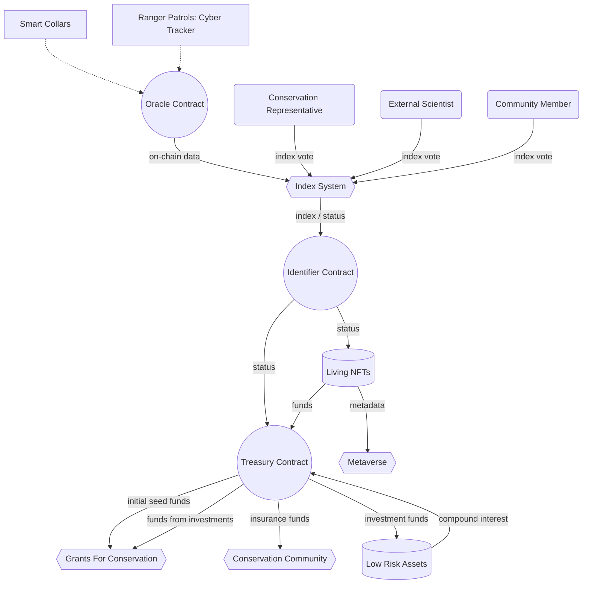
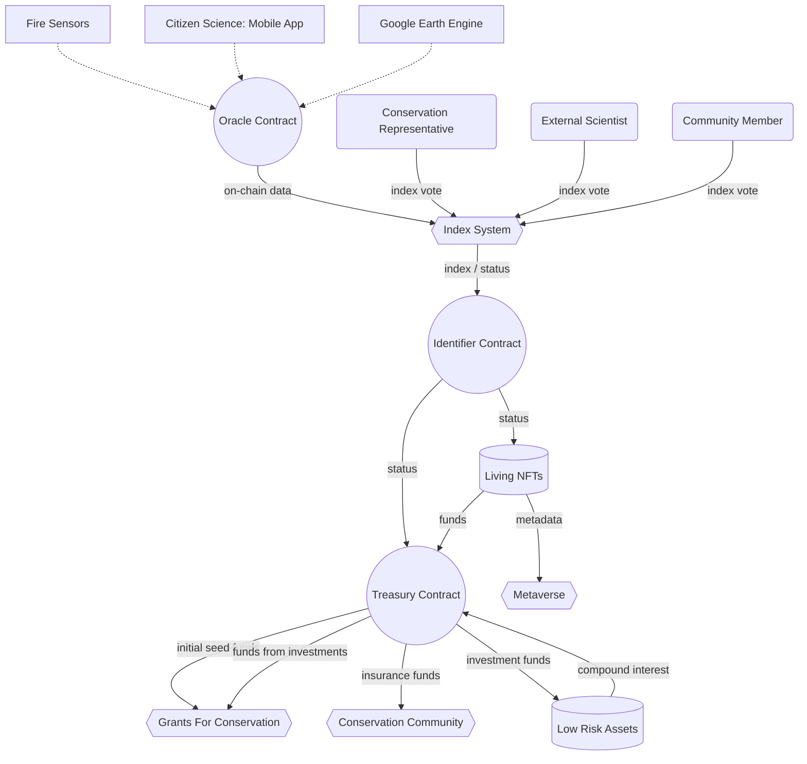

# Use Cases

Sovereign Nature Identifier works as a digital soul for an object of nature. As a digital soul, it follows the concept of Soul Bound NFT which means that only one Sovereign Nature Identifier exist per object. However, Sovereign Nature Identifier can be connected to variety of derivatives which are always created from its Soul.
While getting more derivatives Sovereign Nature Identifier getting a proof of its own existence. In return all connected derivatives are benefitting not only from the proof of source, but also from using the data attached to the Sovereign Nature Identifier.

## Potential Use Cases By Field

### NFT Art

_Soul Connected_ NFT Art is a natural extension to the Sovereign Nature Identifier standard. Compared to the traditional NFT art, _Soul Connected_ art can benefit from the following models:

- Art can be connected to the Sovereign Nature Identifier metadata – lifetime cycle, mobility data, satellite images, etc.
- Art can be geocoded and used in location specific AR applications like Pokémon GO, Ingress, etc.
- Art can be represented as _Living NFT_ – self destructing NFTs bound to specific Sovereign Nature Identifier states or indexes.
- NFT sale profits can be connected to the participants of the Sovereign Nature Identifier ecosystem (custom geo-based funds distribution scheme).

### Tech for Conservation

Conservancies can use Sovereign Nature Identifier to create a base ground or transparency for their funding process. In return, conservancies can also be oracles for Sovereign Nature Identities, showing their wildlife resources, putting them on chain and reusing these created digital objects for future funding proposals.

Typical Sovereign Nature Identifier use cases for conservation will be:

- Identification of wildlife elements in conservations (Sovereign Nature Identifier creation and oraclisation) and profiting from derivatives (Soul Connected NFTs) sales.
- Granting proposals with metrics connectivity – for example identify 10 lions with Sovereign Nature Identity and preserve their existence for 10 years.
- DAO stewardship based on ve like tokens (veCurve, veOcean) where profits from Soul Connected projects are distributed between ve token holders.
- Sovereign Nature Identity connected liquidity pools with nature based AMM curves.

### Metaverse

While Sovereign Nature Identifier doesn’t force us to an exact nature representation it gives us tooling for connected representation to geo referenced and proven wildlife element.
Sovereign Nature Identifier representations can be stored in forms of images, 3d models, sounds, or texts. Each of the representations bound to NFT smart contract connected to original Sovereign Nature Identifier.

Such standard and open structure allows Sovereign Nature Identifier to be integrated into variety of NFT driven Metaverse projects through representation bridges, which might look like:

- Metaverse Bridge which provides Sovereign Nature Identity connected 3d models, images, or sounds to various Metaverse projects. Since all assets will be geo referenced by original metadata it automatically opens possibilities for immersive AR experiences.
- Identified Nature Asset Store – like Unity Asset Store but for representations that developers can include into their own Metaverse.
- Nature Data Store – data from Sovereign Nature Identifiers can be used in Metaverse that support procedural assets generation.

### GIS

In its core Sovereign Nature Identifier is a GIS based token because every id is bound to specific geographic primitive – point or polygon. This opens a way for variety of GIS integration patterns with existing tools used by conservation specialists.

For example:

- Data from CyberTracker can be used in oraclisation process, supplying core tool for wildlife dataset building and identification pipeline.
- EarthRanger can be used for Sovereign Nature Identifiers display, oraclisation and data enhancement.
- Google Earth Engine can be used for Sovereign Nature Identifiers oraclisation and data enhancement.
- QGIS can be extended with Sovereign Nature Identifier connector plugins which will allow us to use it as oraclisation and data enhancement tool.

### IOT

For Sovereign Nature Identifier usage in Internet of Things field we see it as an essential tool for smart collars and other sensor data identification and collection. It will include following use cases:

- Sovereign Nature Identifier enhanced smart collars for wildlife animals – collars that will include Sovereign Nature Identifier signatures by default with metadata that can be populated later during the identification process. Such collars can be developed together with Smart Parks.
- Plugins for LoRaWan ChirpStack that will automate Sovereign Nature Identity metadata updates.
- Simple Sensor Oracle – tool that will make arbitrary sensor oraclisation process simple. For example, we can easily oraclise Nature Cognita and soil sensors in De Ceuvel.

## Conservation With Sovereign Nature Identifier

### Endangered Species Conservation

We can use Sovereign Nature Identifier to protect endangered animals using "insurance like" workflow.

The seed funding can be spend on building initial infrastructure - reinforcement of built environment, smart collars, citizen science incentives.

Insurance system can be used for community compensation to reduce human-wildlife conflicts or to insure existing animals.

### Forest Area Protection

For forest area protection we have different datasets available for voting on, but the overall scheme keeps similar structure.

The seed funding can be spend on reforestation, initial fire protection, installment of sensors in the area.

