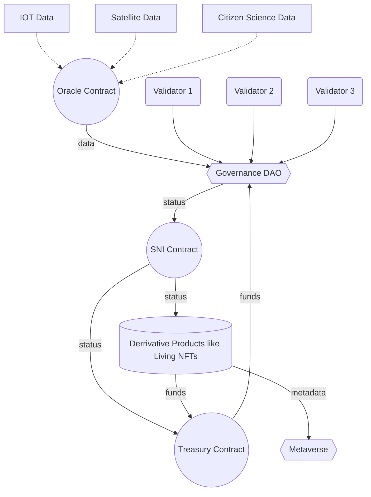

# Sovereign Nature Identifier

Sovereign Nature Identifier is written in Solidity language and can be deployed to any EVM based blockchain.

Its solidity contract deploys following interfaces:

- [IERC721](https://github.com/OpenZeppelin/openzeppelin-contracts/blob/master/contracts/token/ERC721/IERC721.sol) - main Etherium NFT standard.
- [IERC721Metadata](https://github.com/OpenZeppelin/openzeppelin-contracts/blob/master/contracts/token/ERC721/extensions/IERC721Metadata.sol) - metadata extension.
- [IERC2477](https://eips.ethereum.org/EIPS/eip-2477) - metadata and schema integrity.

In addition to these interfaces, smart contract will implement custom interface:

```solidity
interface ISNI {
  /// @notice Returns identified object status
  function status(uint256 _tokenId) external view returns (uint256);

  /// @notice Sets identified object status, can be called only from oracle address.
  function setStatus(uint256 _tokenId, uint256 _status) external;

  /// @notice Returns oracle address.
  function oracleAddress(uint256 _tokenId) external view returns (string);
}
```

## Token Metadata

We store most of the smart contract data off chain as JSON document. The document should be hosted on IPFS and pinned. This will allow users to introspect metadata changes between token states.

The token metadata can be validated by the JSON Schema.

### Metadata JSON Schema

```json
{
  "$schema": "https://json-schema.org/draft/2020-12/schema"
  "$id": "https://example.com/address.schema.json"
  "title": "Sovereign Nature Identifier",
  "type": "object",
  "properties": {
    "name": {
      "type": "string",
      "description": "Identifies the asset to which this token represents."
    },
    "description": {
      "type": "string",
      "description": "Describes the asset to which this token represents."
    },
    "image": {
      "type": "string",
      "description": "A URI pointing to a resource with mime type image/* representing the asset to which this NFT represents. Consider making any images at a width between 320 and 1080 pixels and aspect ratio between 1.91:1 and 4:5 inclusive."
    },
    "properties": {
        "type": "object",
        "description": "Identifier properties."
        "properties": {
          "statusDescription": {
            "type": "object",
            "description": "status field states description"
          },
          "taxonId": {
            "type": "string"
          },
          "conservationStatus": {
            "type": "string"
          },
          "geometry": {
            "type": "string"
          }
        }
    }
  }
}
```

### Alternative Metadata updates

As an alternative to pure IPFS pinning we can use protocols like [Ceramic Network](https://ceramic.network/). It will allow us to fix IPFS CID while keeping metadata on IPFS updatable. Ceramic Network will record all metadata updates and store verifiable history on its blockchain while keeping CID constant.

## Linking NFTs to Sovereign Nature Identifier

::: warning
This part of specification is still under heavy reconsideration. We need to consider cross chained addressing for oracles and cross chain event indexing.
:::

To link NFT to Sovereign Nature Identifier we can use [EIP-5114](https://eips.ethereum.org/EIPS/eip-5114) standard. For cross chain support we can refer to [CAIP-10 Link](https://developers.ceramic.network/docs/advanced/standards/stream-programs/caip10-link/) standard.

## Other Types of Smart Contracts

Beyond Sovereign Nature Identifier smart contract we want to introduce 2 more contract types in the future:

- Oracle Contract - updates status of the Sovereign Nature Identifier pulling information from other sources.
- Governance Contract - links liquidity to Sovereign Nature Identifier and governs it based on Identifier contract status.

Bellow you can find a scheme illustrating smart contracts relationships:


