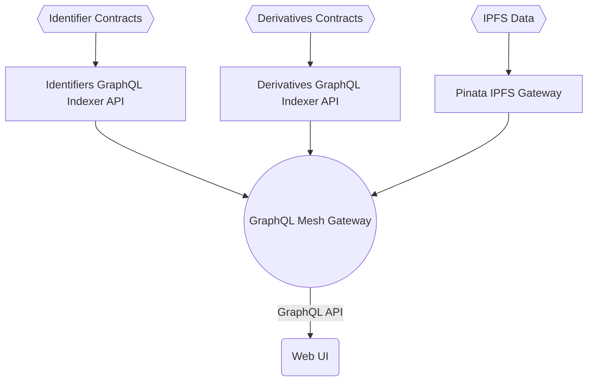

# **WARNING: This repo is under heavy refactoring, a lot of things might be broken and changed.**

# DEEP Protocol

## Services Status


## What's inside?

This monorepo uses [turborepo](https://turborepo.org/) for tasks/caching and yarn as a package manager. It includes the following packages/apps:

Apps:

- `@sni/contracts`: Solidity contracts for Sovereign Nature Identifier built with [Hardhat](https://hardhat.org/) and [OpenZeppelin](https://www.openzeppelin.com/).
- `@sni/indexer`: indexer for [The Graph](https://thegraph.com/).
- `@sni/gateway`: GraphQL gateway built with [GraphQL Mesh](https://the-guild.dev/graphql/mesh)
- `@sni/verification-portal`: DEEP Link verification UI.

Packages:

- `@sni/constants`: Shared constants.
- `@sni/configs`: Shared configs.
- `@sni/json-schemas`: Shared JSON schemas.
- `@sni/solidity-interfaces`: Shared Solidity interfaces, like IDerivative.

## Identifier Core Services Architecture (Outdated)



## Installing Dependencies

To install dependencies for whole monorepo run `pnpm i` from the root repo directory.

## Build

To build all apps and packages, run the following command:

```shell
pnpm build
```

### Develop

To develop all apps and packages, run the following command:

```shell
pnpm dev
```

To develop specific package run:

```shell
pnpm dev --filter <PACKAGE_NAME>
```

For example, to develop verification portal, run:

```shell
pnpm dev --filter @sni/verification-portal
```

## Remote Caching

Turborepo can use a technique known as [Remote Caching](https://turborepo.org/docs/core-concepts/remote-caching) to share cache artifacts across machines, enabling you to share build caches with your team and CI/CD pipelines.

By default, Turborepo will cache locally. To enable Remote Caching you will need an account with Vercel. If you don't have an account you can [create one](https://vercel.com/signup), then enter the following commands:

```shell
npx turbo login
```

This will authenticate the Turborepo CLI with your [Vercel account](https://vercel.com/docs/concepts/personal-accounts/overview).

Next, you can link your Turborepo to your Remote Cache by running the following command from the root of your turborepo:

```shell
npx turbo link
```
