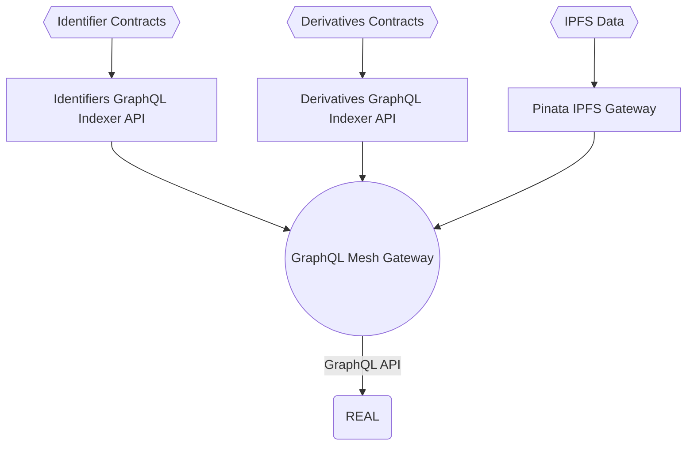

## Identifier Core Services Architecture (Outdated)

```mermaid
flowchart TD;
IPFSData{{IPFS Data}}-->IPFSGateway
DerivativeContracts{{Derivatives Contracts}}-->DerivativesIndexer
IdentifierContracts{{Identifier Contracts}}-->IdentifiersIndexer
IdentifiersIndexer[Identifiers GraphQL Indexer API]-->Gateway((GraphQL Mesh Gateway));
DerivativesIndexer[Derivatives GraphQL Indexer API]-->Gateway;
IPFSGateway[Pinata IPFS Gateway]-->Gateway
Gateway--GraphQL API-->UI(REAL)
```
